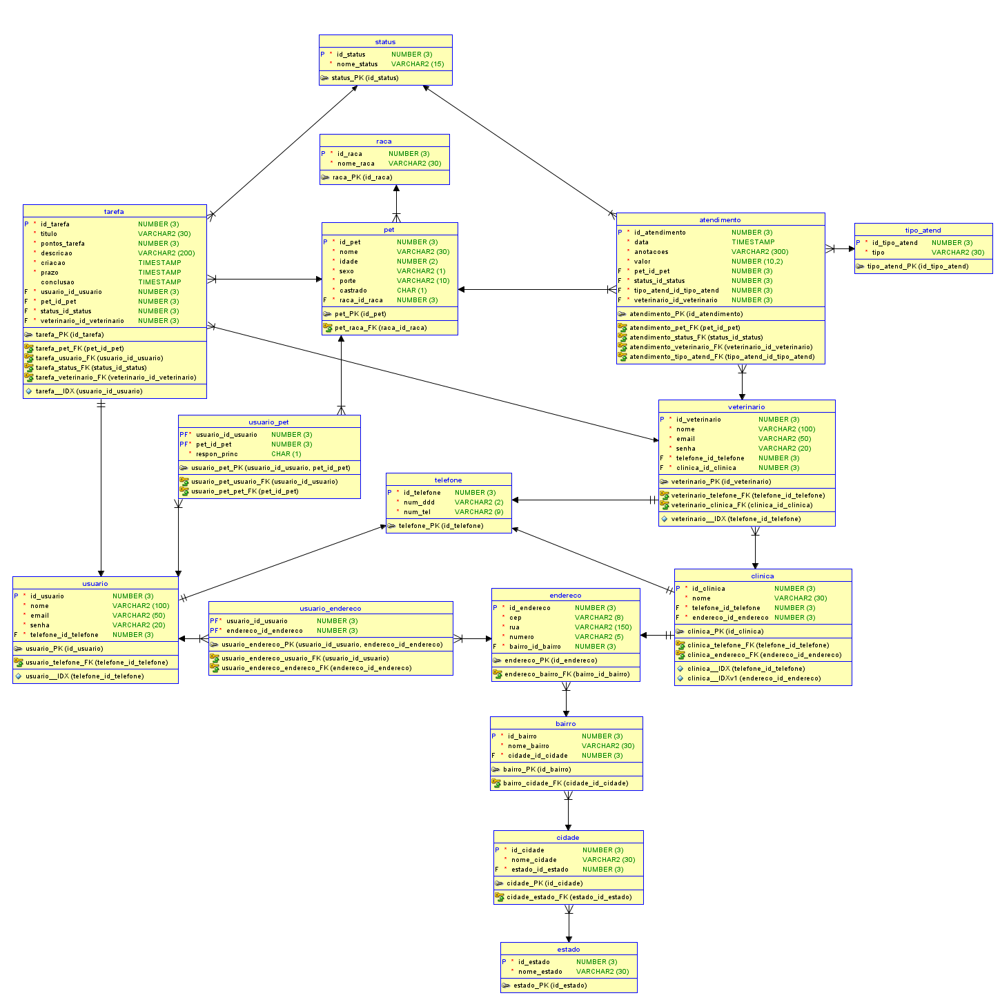
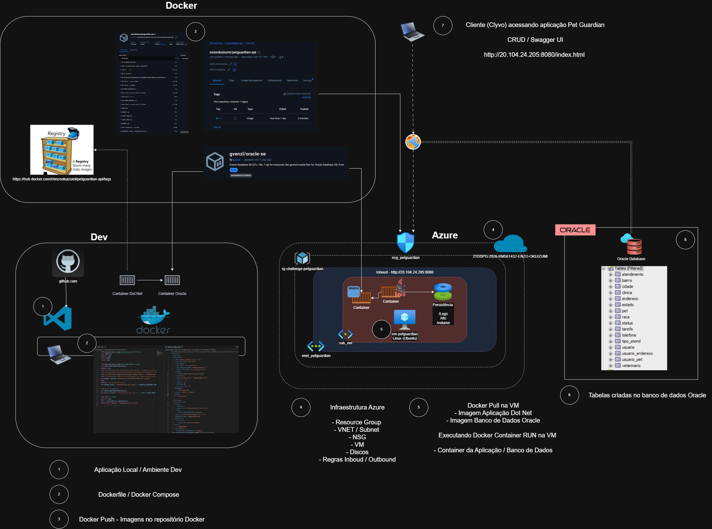

# DevOps-Tools-Cloud-Computing - 🐾 PetGuardian

> **DevOps & Cloud Computing**
> 
> API REST em .NET 10 desenvolvida para facilitar o **cuidado colaborativo de pets**. Focada na gestão de tarefas de saúde prescritas por veterinários, círculos de cuidado compartilhados, histórico clínico unificado e gamificação baseada em pontos.

---

## 🛠️ Tecnologias & Badges


---

## 💡 Sobre o Produto

O **PetGuardian** foi concebido para resolver o problema da descentralização do cuidado diário de animais domésticos quando mais de um cuidador está envolvido. A plataforma organiza responsabilidades, registra o histórico de saúde e incentiva a realização de tarefas através de um sistema gamificado.

### 🌟 Pilares do Domínio
* **Círculo de Cuidado Colaborativo:** Vínculo dinâmico `N:N` entre cuidadores (`Usuario`) e `Pet` via tabela associativa gerenciada.
* **Tarefas Prescritas com Pontuação:** Divisão de tarefas diárias com pontuação proporcional à complexidade.
* **Histórico Clínico Unificado:** Consolidação cronológica decrescente contendo atendimentos veterinários e tarefas concluídas.
* **Gamificação:** Score cumulativo individual para os cuidadores à medida que realizam os cuidados.

### 🗄️ Modelagem Relacional do Banco de Dados



---

## 📂 Estrutura do Repositório

```text
PetGuardian/
  ├── PetGuardian.API/         # Endpoints, Middlewares e Injeção de Dependência
  ├── PetGuardian.Application/ # Camada de Aplicação (DTOs, Regras de Negócio e Serviços)
  ├── PetGuardian.Domain/      # Entidades Core de Domínio e Invariantes
  ├── PetGuardian.Infrastructure/ # Persistência (EF Core, Configurações Oracle e Migrations)
  ├── docker-compose.yml       # Orquestração do Banco Oracle + API na VM Azure
  └── DEPLOYMENT.md            # Guia complementar de deploy
```

---

## 📈 Benefícios da Solução para o Negócio
* **Centralização do Cuidado:** Consolida o histórico clínico de pets e tarefas diárias, eliminando falhas de comunicação entre tutores e co-cuidadores.
* **Engajamento e Fidelização:** A gamificação (sistema de score) motiva a participação ativa nas tarefas cotidianas de saúde do pet, convertendo obrigações em interações gamificadas.
* **Prevenção de Complicações Médicas:** O acompanhamento cronológico rigoroso de medicamentos, vacinas e consultas evita esquecimentos e complicações de saúde, reduzindo custos com internações emergenciais.
* **Portabilidade e Nuvem:** O uso de containers Docker garante que a aplicação execute com consistência absoluta desde o desenvolvimento local até a infraestrutura em nuvem na VM Azure.

---

## 📐 Desenho Macro da Arquitetura
A arquitetura da solução no ambiente Azure funciona conforme o fluxo de componentes abaixo:



---

## ☁️ Script Completo do Azure CLI
Abaixo está o script sequencial em shell para provisionar a infraestrutura necessária na nuvem Azure e preparar a VM com Docker:

```bash
#!/usr/bin/env bash
set -e

# Variáveis do Ambiente
RG="rg-challenge-clyvo-vet"
LOCATION="brazilsouth"
VNET="vnet_wise_dev"
SUBNET="sub_net_dev"
NSG="nsg_portalweb_dev"
VM="vm-wise-clyvo-dev-01"
ADMIN="azureuser"

# 1. Provisionar Grupo de Recursos
az group create --name "$RG" --location "$LOCATION"

# 2. Provisionar VNet e Subnet
az network vnet create \
  --resource-group "$RG" \
  --location "$LOCATION" \
  --name "$VNET" \
  --address-prefixes 10.10.0.0/16 \
  --subnet-name "$SUBNET" \
  --subnet-prefixes 10.10.1.0/24

# 3. Provisionar Network Security Group (NSG)
az network nsg create --resource-group "$RG" --location "$LOCATION" --name "$NSG"

# 4. Provisionar VM Ubuntu 22.04 LTS
az vm create \
  --resource-group "$RG" \
  --name "$VM" \
  --image Ubuntu2204 \
  --size Standard_B2pls_v2 \
  --admin-username "$ADMIN" \
  --generate-ssh-keys \
  --vnet-name "$VNET" \
  --subnet "$SUBNET" \
  --nsg "$NSG"

# 5. Liberar Portas Necessárias (SSH, API .NET, Oracle)
az vm open-port --resource-group "$RG" --name "$VM" --port 22 --priority 1000
az vm open-port --resource-group "$RG" --name "$VM" --port 8080 --priority 1010
az vm open-port --resource-group "$RG" --name "$VM" --port 1521 --priority 1020

# 6. Instalação automatizada do Docker e Dependências
az vm run-command invoke \
  --resource-group "$RG" \
  --name "$VM" \
  --command-id RunShellScript \
  --scripts "sudo apt-get update && sudo apt-get install -y git nano curl ca-certificates && curl -fsSL https://get.docker.com | sudo sh && sudo usermod -aG docker $ADMIN"

# Exibe o IP Público gerado para conexões
az vm show --resource-group "$RG" --name "$VM" --show-details --query publicIps --output tsv
```

---

## 🐋 Dockerfile & Docker Compose da Aplicação

### Dockerfile da API (Segurança Não-Root)
Localizado em `PetGuardian.API/Dockerfile`:
```dockerfile
FROM mcr.microsoft.com/dotnet/aspnet:10.0 AS base
USER $APP_UID
WORKDIR /app
EXPOSE 8080
EXPOSE 8081

FROM mcr.microsoft.com/dotnet/sdk:10.0 AS build
ARG BUILD_CONFIGURATION=Release
WORKDIR /src
COPY ["PetGuardian.API/PetGuardian.API.csproj", "PetGuardian.API/"]
COPY ["PetGuardian.Application/PetGuardian.Application.csproj", "PetGuardian.Application/"]
COPY ["PetGuardian.Domain/PetGuardian.Domain.csproj", "PetGuardian.Domain/"]
COPY ["PetGuardian.Infrastructure/PetGuardian.Infrastructure.csproj", "PetGuardian.Infrastructure/"]
RUN dotnet restore "PetGuardian.API/PetGuardian.API.csproj"
COPY . .
WORKDIR "/src/PetGuardian.API"
RUN dotnet build "./PetGuardian.API.csproj" -c $BUILD_CONFIGURATION -o /app/build

FROM build AS publish
ARG BUILD_CONFIGURATION=Release
RUN dotnet publish "./PetGuardian.API.csproj" -c $BUILD_CONFIGURATION -o /app/publish /p:UseAppHost=false

FROM base AS final
WORKDIR /app
COPY --from=publish /app/publish .
ENTRYPOINT ["dotnet", "PetGuardian.API.dll"]
```

### Docker Compose Orquestrador (`docker-compose.yml`)
Localizado em `PetGuardian/docker-compose.yml`:
```yaml
services:
  oracle-db:
    image: gvenzl/oracle-xe:21-slim
    container_name: oracle-db
    environment:
      ORACLE_PASSWORD: "OracleRoot123"
      APP_USER: "APP_USER"
      APP_USER_PASSWORD: "AppPassword123"
    volumes:
      - oracle_data:/opt/oracle/oradata
    healthcheck:
      test: ["CMD-SHELL", "healthcheck.sh"]
      interval: 10s
      timeout: 5s
      retries: 15
      start_period: 40s
    networks:
      - challenge_net
    restart: unless-stopped
    ports:
      - "1521:1521"

  petguardian-api:
    image: seu_usuario_dockerhub/petguardian-api:latest
    container_name: petguardian-api
    depends_on:
      oracle-db:
        condition: service_healthy
    ports:
      - "8080:8080"
    environment:
      ASPNETCORE_ENVIRONMENT: Production
      ASPNETCORE_HTTP_PORTS: 8080
      ConnectionStrings__PetGuardianOracle: "User Id=APP_USER;Password=AppPassword123;Data Source=oracle-db:1521/XEPDB1;"
    networks:
      - challenge_net
    restart: on-failure

networks:
  challenge_net:
    driver: bridge

volumes:
  oracle_data:
```

---

## 📋 Documentação de Rotas (OpenAPI / Swagger)

### 1. Endereço e Localização (Integração ViaCEP)
| Método | Rota | Descrição | Exemplo de Payload |
| :--- | :--- | :--- | :--- |
| `POST` | `/api/endereco` | Cadastra endereço buscando dados automaticamente via CEP. | `{ "cep": "01311000", "numero": "1100" }` |

### 2. Usuários & Gamificação
| Método | Rota | Descrição | Exemplo de Payload |
| :--- | :--- | :--- | :--- |
| `POST` | `/api/usuario` | Cadastra um novo cuidador vinculado a um telefone existente. | `{ "nome": "Enzo", "email": "enzo@example.com", "senha": "123mudar", "telefoneId": "3fa85f64-5717-4562-b3fc-2c963f66afa6" }` |
| `GET` | `/api/usuario/{id}/score` | Retorna o score total e tarefas concluídas pelo usuário. | *Retorna score acumulado* |
| `GET` | `/api/usuario` | Lista todos os cuidadores cadastrados. | - |

### 3. Rede de Cuidado & Convites
| Método | Rota | Descrição | Exemplo de Payload |
| :--- | :--- | :--- | :--- |
| `GET` | `/api/usuariopet/rede-cuidado/{usuarioId}` | Lista a rede de co-cuidadores e pets vinculados àquele usuário. | - |
| `POST` | `/api/usuariopet/invite/by-usuario` | Convida outro usuário pelo ID (Exclusivo para Responsável Principal). | `{ "adminUsuarioId": "guid", "usuarioConvidadoId": "guid", "petId": "guid" }` |
| `POST` | `/api/usuariopet/invite/by-email` | Convida outro usuário buscando pelo e-mail registrado. | `{ "adminUsuarioId": "guid", "email": "amigo@email.com", "petId": "guid" }` |

### 4. Pets & Histórico Clínico
| Método | Rota | Descrição | Exemplo de Payload |
| :--- | :--- | :--- | :--- |
| `POST` | `/api/pet` | Cadastra um pet vinculado a uma Raça. | `{ "nome": "Rex", "idade": 3, "sexo": 1, "porte": 2, "racaId": "guid" }` |
| `GET` | `/api/pet/{id}/historico` | Retorna a linha do tempo clínica e de cuidados do pet. | - |

### 5. Cuidado Diário (Tarefas Prescritas)
| Método | Rota | Descrição | Exemplo de Payload |
| :--- | :--- | :--- | :--- |
| `POST` | `/api/tarefa` | Prescreve uma nova tarefa vinculada a um pet (sem executor). | `{ "titulo": "Dar Vacina", "pontosTarefa": 50, "descricao": "Aplicar dose 2", "prazo": "2026-06-01T12:00:00Z", "petId": "guid", "veterinarioId": "guid" }` |
| `POST` | `/api/tarefa/{id}/concluir` | Registra a conclusão da tarefa pelo usuário, gerando os pontos para o score de quem concluiu. | `{ "usuarioId": "guid" }` |

---

## 📖 Instruções de Instalação e Execução na VM (How To)

### 1. Build e Upload da Imagem (Máquina de Desenvolvimento Local)
```bash
# Efetue login no Docker Hub
docker login

# Build e Tags da imagem
docker build -t petguardian-api:v1 -f PetGuardian/PetGuardian.API/Dockerfile PetGuardian/
docker tag petguardian-api:v1 seu_usuario_dockerhub/petguardian-api:latest

# Enviar imagem
docker push seu_usuario_dockerhub/petguardian-api:latest
```

### 2. Execução do Deploy na VM Azure (Passo a Passo)
1. **Conecte via SSH na VM provisionada:**
   ```bash
   ssh azureuser@<IP_PUBLICO_DA_VM>
   ```
2. **Clone seu repositório na VM:**
   ```bash
   git clone https://github.com/Enzo-C/DevOps-Tools-Cloud-Computing.git challenge-devops
   cd challenge-devops/PetGuardian
   ```
3. **Edite o arquivo `docker-compose.yml` para referenciar a imagem do Docker Hub:**
   ```bash
   nano docker-compose.yml
   # Modifique a propriedade "image" do serviço "petguardian-api" para:
   # image: seu_usuario_dockerhub/petguardian-api:latest
   ```
4. **Execute os containers em background:**
   ```bash
   docker compose up -d
   ```
5. **Verifique se as tabelas foram migradas e a aplicação está saudável:**
   ```bash
   docker compose ps
   docker logs petguardian-api
   ```
6. **Acesse remotamente o Swagger da API via IP público:**
   * URL: `http://<IP_PUBLICO_DA_VM>:8080/index.html`
